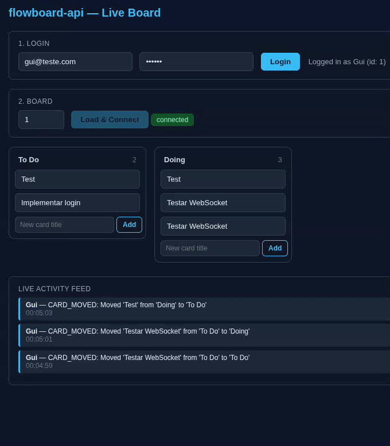

# flowboard-api

A real-time Kanban-style task management API built with Spring Boot, featuring JWT authentication with role-based access control, WebSocket-powered live updates, and fine-grained authorization at the resource level.



## Why this project

This is the second project in a two-project backend portfolio (alongside [finance-api](https://github.com/gothsins/finance-api)), built specifically to cover ground the first project didn't: Spring Security with roles, real-time communication via WebSocket, and many-to-many relational modeling. Where finance-api demonstrates message queues, caching, and batch processing, flowboard-api demonstrates authentication/authorization depth and real-time architecture.

## Features

- **JWT authentication** — stateless auth with BCrypt password hashing, HMAC-signed tokens (HS256), and explicit claim scoping (no sensitive data in the payload)
- **Role-based + ownership-based authorization** — global roles (`ADMIN`/`MEMBER`) combined with per-resource ownership checks (board owner vs. board member have different permissions on the same board)
- **Real-time updates via WebSocket (STOMP)** — card moves, creations, and membership changes broadcast live to everyone viewing a board, authenticated via JWT at the STOMP `CONNECT` frame
- **Activity log** — every meaningful action (card created/moved, member added/removed) is persisted and streamed live
- **Many-to-many board membership** — users can belong to multiple boards; boards can have multiple members, modeled with a proper join table
- **Clean REST/DTO boundary** — entities are never serialized directly; every endpoint uses purpose-built request/response DTOs to avoid `LazyInitializationException` and prevent over-posting (e.g. a client can never set their own role)
- **Correct HTTP semantics** — `401` for missing/invalid authentication vs. `403` for authenticated-but-unauthorized, via a custom `AuthenticationEntryPoint`

> **Note:** in production, set `JWT_SECRET` as an environment variable — never rely on the default value in `application.properties`.
## Tech stack

| Layer | Technology                           |
|---|--------------------------------------|
| Language / Runtime | Java 21                              |
| Framework | Spring Boot 3.5.3                    |
| Security | Spring Security, JWT (jjwt 0.12)     |
| Persistence | Spring Data JPA, PostgreSQL          |
| Real-time | Spring WebSocket (STOMP over SockJS) |
| Docs | springdoc-openapi (Swagger UI)       |
| Build | Maven                                |
| Local infra | Docker Compose (PostgreSQL)          |

## Architecture notes

**Entity relationships**

- `User` owns zero or more `Board`s, and can be a member of many boards (`@ManyToMany`, via a `board_members` join table)
- `Board` contains multiple `BoardColumn`s (e.g. "To Do", "Doing", "Done")
- `BoardColumn` contains multiple `Card`s
- `Card` optionally has an `assignee` (`User`)
- Every meaningful action on a `Board` generates an `ActivityLog` entry, which is broadcast live to `/topic/board/{id}` via WebSocket

- `Board ↔ User` is a genuine `@ManyToMany`, backed by an explicit `board_members` join table.
- All `@ManyToOne`/`@ManyToMany` associations are unidirectional and `LAZY` by design — avoids circular serialization and the `MultipleBagFetchException` class of bugs.
- Authorization is enforced explicitly in the service layer (`assertIsOwner` / `assertIsMember`), not hidden behind SpEL expressions in annotations — every permission check is a plain, readable `if`.

**WebSocket authentication**

WebSocket connections don't pass through the standard servlet filter chain the way REST requests do. Authentication happens instead via a `ChannelInterceptor` that validates the JWT on the STOMP `CONNECT` frame and attaches the authenticated principal to the session — every subsequent `SUBSCRIBE`/`SEND` on that connection is already authenticated, without re-validating the token per message.

**HTTP status semantics**

A custom `AuthenticationEntryPoint` ensures missing/invalid tokens return `401 Unauthorized`, while `AccessDeniedException` (thrown from ownership/membership checks) returns `403 Forbidden` — handled centrally in a `@RestControllerAdvice`.

## Running locally

```bash
docker compose up -d
mvn spring-boot:run
```

The API starts on `http://localhost:8083`. Swagger UI is available at `http://localhost:8083/swagger-ui/index.html`.

### Try it with curl

```bash
# Register
curl -X POST http://localhost:8083/auth/register \
  -H "Content-Type: application/json" \
  -d '{"name":"Gui","email":"gui@example.com","password":"123456"}'

# Create a board (use the token from above)
curl -X POST http://localhost:8083/boards \
  -H "Content-Type: application/json" \
  -H "Authorization: Bearer <token>" \
  -d '{"title":"Sprint 1","description":"First sprint board"}'
```

### Try the live board

Open `test-client/websocket-test-client.html` directly in a browser (no server needed — it talks to `localhost:8083`). Log in, load a board, and drag cards between columns. Open a second tab logged in as a different member of the same board to see updates arrive in real time.

## API overview

| Method | Endpoint | Description |
|---|---|---|
| POST | `/auth/register` | Create an account, returns JWT |
| POST | `/auth/login` | Authenticate, returns JWT |
| POST | `/boards` | Create a board |
| GET | `/boards` | List boards you own or belong to |
| GET | `/boards/{id}` | Get a board (members only) |
| PUT | `/boards/{id}` | Update a board (owner only) |
| DELETE | `/boards/{id}` | Delete a board (owner only) |
| POST | `/boards/{id}/members/{userId}` | Add a member (owner only) |
| DELETE | `/boards/{id}/members/{userId}` | Remove a member (owner only) |
| POST | `/boards/{id}/columns` | Create a column (members) |
| GET | `/boards/{id}/columns` | List columns (members) |
| PUT | `/columns/{id}` | Rename a column (members) |
| DELETE | `/columns/{id}` | Delete a column (members) |
| POST | `/columns/{id}/cards` | Create a card (members) |
| GET | `/columns/{id}/cards` | List cards in a column (members) |
| PUT | `/cards/{id}` | Update a card (members) |
| PATCH | `/cards/{id}/move` | Move a card between columns (members) |
| DELETE | `/cards/{id}` | Delete a card (members) |

Full request/response schemas available via Swagger UI.

## Roadmap

This project is built to evolve in place — the domain logic stays the same while the infrastructure underneath is progressively swapped for more production-grade equivalents:

- [ ] Replace the in-memory STOMP broker (`enableSimpleBroker`) with a Kafka-backed relay, enabling horizontal scaling across multiple API instances
- [ ] Deploy to AWS (ECS + RDS), replacing local Docker Compose Postgres
- [ ] Rate limiting on WebSocket connections (DoS mitigation)

## Architecture evolution

This project is deliberately built in two layers: **domain logic** (entities, services, authorization rules) and **infrastructure** (where it runs, how events are distributed). The domain logic is considered stable — the roadmap above only swaps out infrastructure underneath it, without rewriting business logic.

| Concern | Today | Planned |
|---|---|---|
| Real-time message distribution | In-memory STOMP broker (`enableSimpleBroker`), single instance | Kafka-backed relay (`enableStompBrokerRelay`), supports multiple API instances |
| Database | Local PostgreSQL via Docker Compose | AWS RDS (managed PostgreSQL) |
| Application hosting | `localhost` | AWS ECS |
| Secrets | `.properties` fallback value (local dev only) | Environment variables / AWS Secrets Manager |

The trigger for each change is a real scaling limitation, not novelty for its own sake:
- **Kafka becomes necessary** the moment the API runs as more than one instance — an in-memory broker can't relay a message from instance A to a client connected on instance B.
- **AWS becomes necessary** for the same reasons any production deployment needs managed infrastructure: uptime, backups, and horizontal scaling that a local machine or a single low-cost host can't provide reliably.

This mirrors the same practical, incremental approach used in [finance-api](#) — infrastructure is added when a concrete need justifies it, not preemptively.

## License

MIT